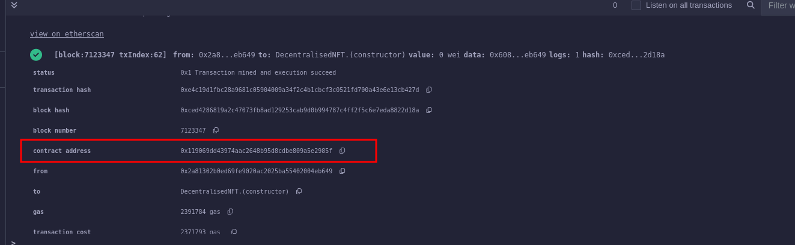
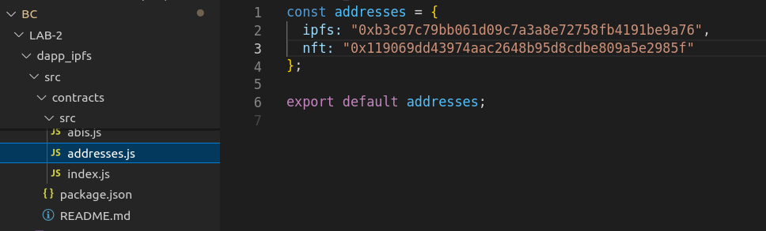
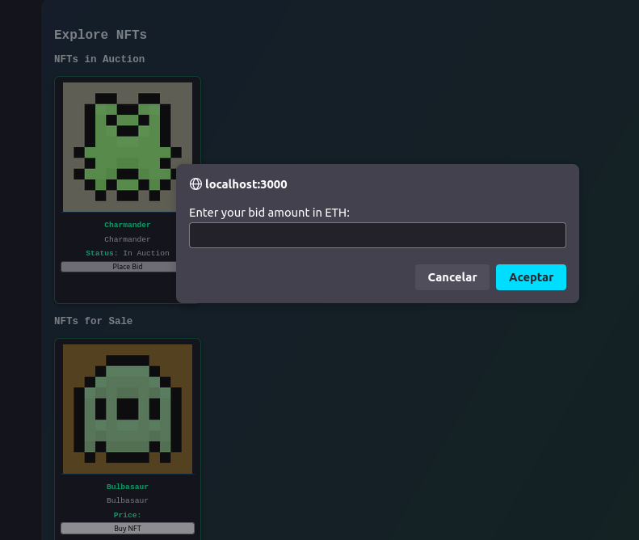
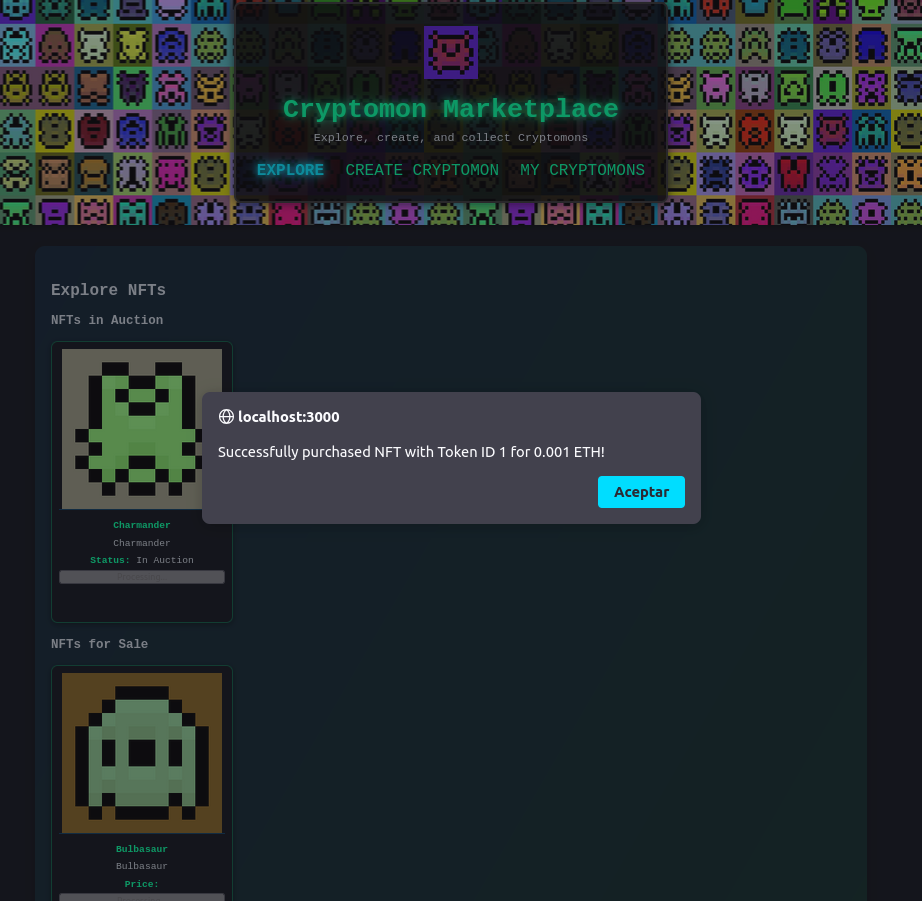

# Documentación del Proyecto

## **Estructura de Carpetas**

- **`dapp_ipfs`**: 
  Contiene el *frontend* desarrollado en React para la aplicación, basado en el ejercicio 1 de la práctica.

- **`docker_ipfs`**: 
  Sistema *IPFS* dockerizado.

- **`sprite_generator`**: 
  API desarrollada con **FastAPI** para generar las imágenes de los NFTs mediante un algoritmo de autómatas celulares. 
  - El código de la API está en la carpeta `sprites`.
  - Principales archivos:
    - `sprites/main.py`: Define los *endpoints* de la API.
    - `sprites/sprites.py`: Implementa el algoritmo generador.

- **`contract`**: 
  Carpeta que contiene el contrato inteligente desarrollado para esta práctica.

---

## **Guía de Uso**

### **1. Desplegar el Contrato**
   - Utiliza **WalletConnect** en **Remix IDE** para desplegar el contrato inteligente. 
   - Copia la dirección del contrato desplegado:

   

### **2. Configurar la Dirección del Contrato**
   - Pega la dirección obtenida en `dapp_ipfs/src/contracts/src/addresses.js` y copia el abi en `dapp_ipfs/src/contracts/src/abis/nftAbi.js`:

   

### **3. Iniciar el Proyecto**
   - Desde la raíz del proyecto, ejecuta el comando:
     ```bash
     docker compose up
     ```

### **4. Acceder a la Aplicación**
   - Abre tu navegador y accede a: `http://localhost:3000`

   

---

## **Funcionalidades**

### **Explorar NFTs**
En la pestaña **Explore**, los usuarios pueden visualizar los NFTs disponibles para comprar o pujar:


### **Gestión de NFTs para Propietarios**
Los propietarios tienen varias opciones para gestionar sus NFTs:

1. **Poner a la Venta o Abrir una Subasta**  
   Los propietarios pueden listar sus NFTs para venta directa o iniciar una subasta (Ahora mismo el campo 'Sale Price' es el bidding time de la subasta ñ_ñ):

   

2. **Cerrar Ventas o Subastas**  
   También pueden cancelar ventas o cerrar subastas activas:

   
   

---

### **Acciones de los Usuarios**

#### **Pujar por un NFT**
   Los usuarios pueden realizar ofertas en subastas activas:

   - Proceso de puja:  
       
     - Puja exitosa:  
       

#### **Comprar un NFT**
   Los usuarios pueden adquirir NFTs que estén a la venta directa:

   - Proceso de compra:  
       
   - Error al intentar comprar (por ejemplo, fondos insuficientes):  
       
   - Compra exitosa:  
     

---
