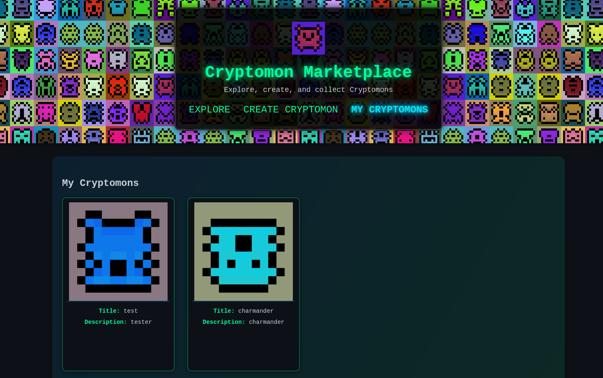
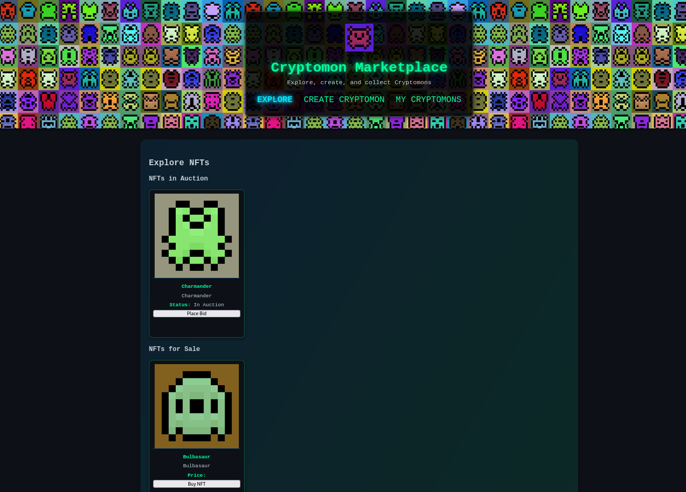
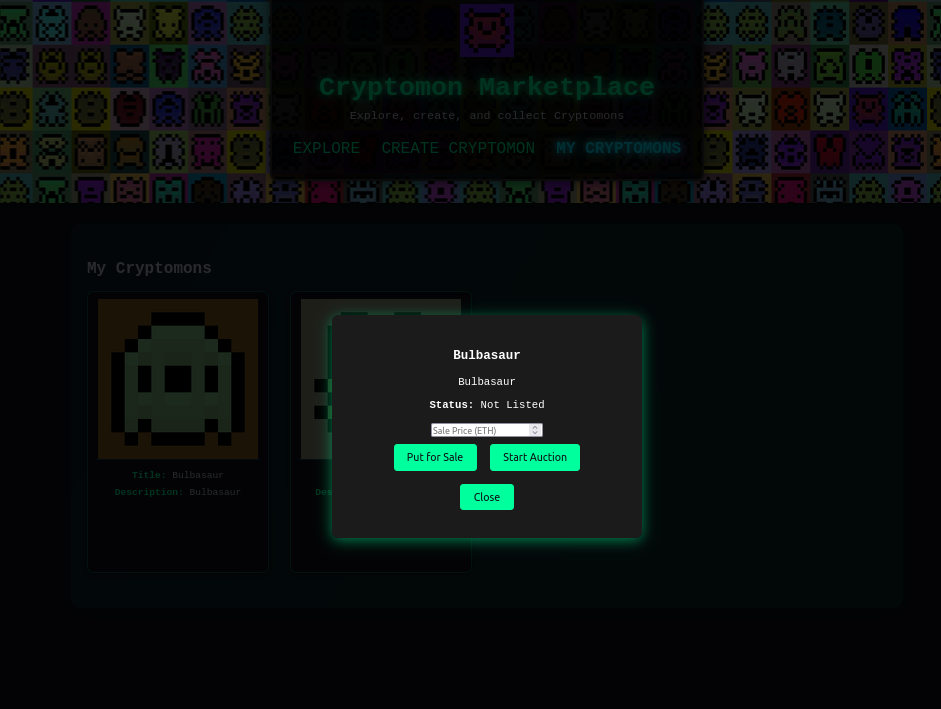
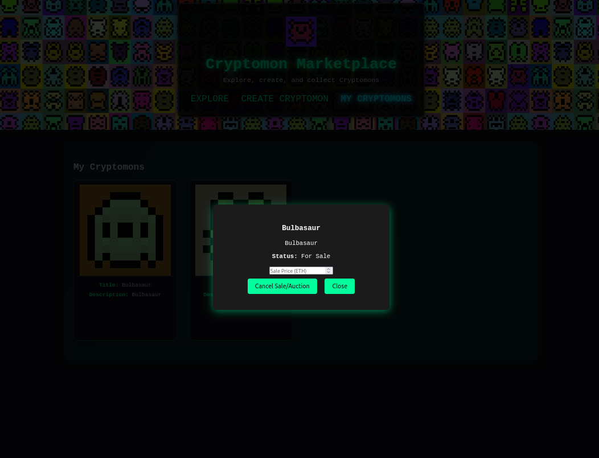
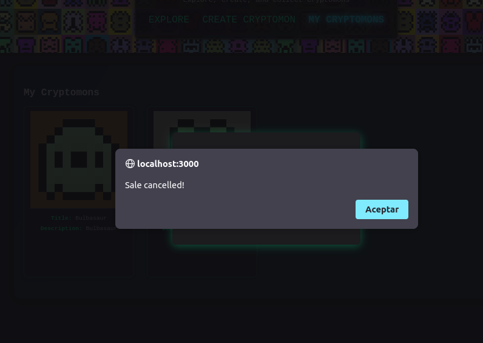
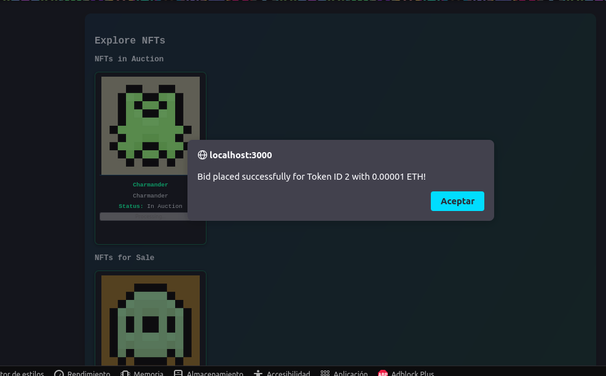
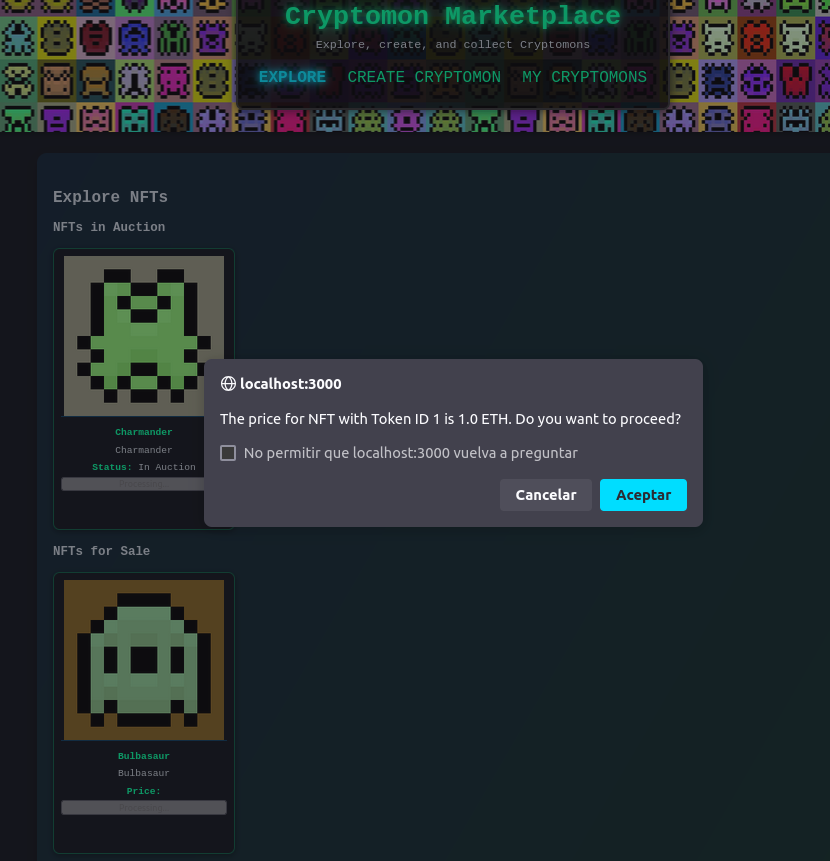
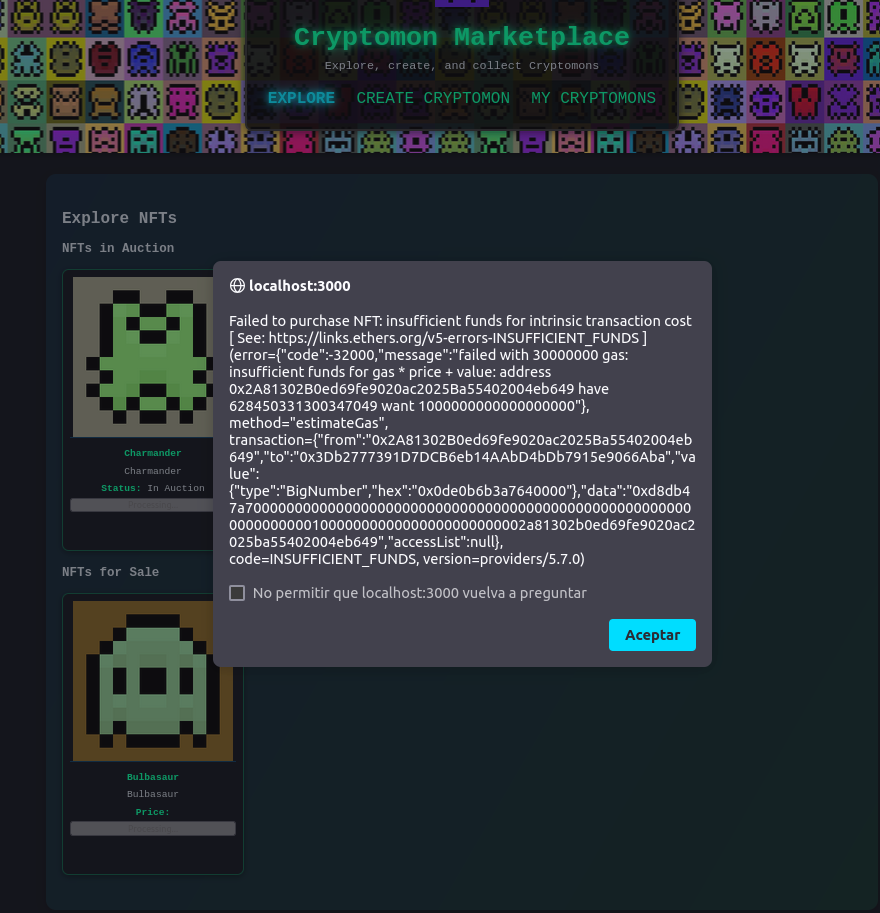

Carpetas:

    - dapp_ipfs: Frontend React de la aplicación, usando como base el del ejercicio 1 de la práctica.
    - docker_ipfs: Sistema IPFS dockerizado.
    - sprite_generator: FastAPI para generar las imágenes de los NFTs a través de un algoritmo de automata celular. El código de la API está en la carpeta "sprites". En "sprites/main.py" se encuentran los endpoints, en "sprites/sprites.py" el algoritmo.
    - contract: El contrato desarrollado para esta práctica.

Uso:
1. Desplegar el contrato a través de WalletConnect en Remix IDE, y copiar la dirección de despliegue:

2. Pegar la dirección en "dapp_ipfs/src/contracts/src/addresses.js"

3. Desde la carpeta raíz del proyecto, lanzar el comando "docker compose up".

4. Acceder a "localhost:3000" para acceder al frontend.

En la pestaña Explore se mostrarán los nfts disponibles para comprar y pujar:

Los propietarios podrán poner a la venta sus nfts, o abrir una subasta:

También podrán cerrarlas:

Un usuario puede pujar por un NFT:

El usuario puede comprar un NFT:

